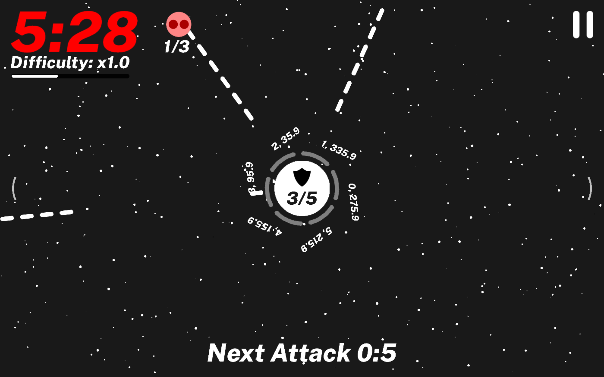

# Battleshield

## About
> A challenging mobile game for Android/iOS.
## Built with
- Java
- [LibGDX](https://libgdx.com/)
- [OpenGL ES](https://khronos.org/opengles/)
## File Structure
```
.
├── android
│   ├── ...
│   └── assets
│       ├── ...
│       ├── Arch.fs.glsl                                                        # GLSL fragment shader
│       ├── BloomStretch.fs.glsl                                                # GLSL fragment shader
│       ├── GaussianBlur.fs.glsl                                                # GLSL fragment shader
│       ├── Portal.fs.glsl                                                      # GLSL fragment shader
│       ├── Refraction.fs.glsl                                                  # GLSL fragment shader
│       ├── StretchWarp.fs.glsl                                                 # GLSL fragment shader
│       ├── All.png                                                             # Texture atlas
│       ├── All.atlas                                                           # Texture atlas
│       └── PublicSans-ExtraBoldItalic.fnt                                      # Bitmap font
├── core
│   ├── ...
│   └── src
│       ├── ...
│       └── com
│           └── yaamani
│               └── battleshield
│                   └── alpha
│                       ├── ...
│                       ├── Game
│                       │   ├── BattleshieldGame.java                           # Main entry point to the entire project
│                       │   ├── ImprovingControlls
│                       │   │   ├── DataMonitoring.java
│                       │   │   └── NetworkAndStorageManager.java
│                       │   ├── Screens
│                       │   │   ├── Gameplay                                    # This directory/package contains all the gameplay logic
│                       │   │   │   ├── Bullet.java
│                       │   │   │   ├── BulletsAndShieldContainer.java
│                       │   │   │   ├── BulletsHandler.java
│                       │   │   │   ├── Controller.java
│                       │   │   │   ├── FreeController.java
│                       │   │   │   ├── GameOverLayer.java
│                       │   │   │   ├── GameplayScreen.java
│                       │   │   │   ├── GlassCrackPostProcessingEffect.java
│                       │   │   │   ├── HealthBar.java
│                       │   │   │   ├── HealthHandler.java
│                       │   │   │   ├── LazerAttack.java
│                       │   │   │   ├── LazerAttackStuff.java
│                       │   │   │   ├── LevelFinishStuff.java
│                       │   │   │   ├── PauseStuff.java
│                       │   │   │   ├── PortalPostProcessingEffect.java
│                       │   │   │   ├── RestrictedController.java
│                       │   │   │   ├── Rewind
│                       │   │   │   │   ├── AffectTimerColorRecord.java
│                       │   │   │   │   ├── AffectTimerRecord.java
│                       │   │   │   │   ├── BulletEffectRecord.java
│                       │   │   │   │   ├── BulletRecord.java
│                       │   │   │   │   ├── LazerAttackRecord.java
│                       │   │   │   │   ├── NextLazerAttackTimerRecord.java
│                       │   │   │   │   ├── PlusMinusBulletsRecord.java
│                       │   │   │   │   ├── PortalRecord.java
│                       │   │   │   │   ├── RewindEngine.java
│                       │   │   │   │   └── TouchInputRecord.java
│                       │   │   │   ├── ScoreMultiplierDifficultyLevelStuff.java    
│                       │   │   │   ├── ScoreTimerStuff.java
│                       │   │   │   ├── Shield.java
│                       │   │   │   ├── ShieldsAndContainersHandler.java
│                       │   │   │   ├── SpecialBulletTempProgressBarUI.java
│                       │   │   │   ├── TrailWarpPostProcessingEffect.java
│                       │   │   │   └── TwoExitPortalUI.java
│                       │   │   ├── LoadingScreen.java
│                       │   │   └── MainMenuScreen.java
│                       │   ├── SolidBG.java
│                       │   ├── Starfield
│                       │   │   ├── Star.java
│                       │   │   └── StarsContainer.java
│                       │   ├── Transitions
│                       │   │   ├── LoadingToMainMenu.java
│                       │   │   └── MainMenuToGameplay.java
│                       │   └── Utilities
│                       │       ├── AndroidPermissionHandler.java
│                       │       ├── Assets.java
│                       │       ├── Constants.java
│                       │       └── OnPermissionResult.java
│                       └── MyEngine
│                           ├── AdvancedApplicationAdapter.java
│                           ├── AdvancedScreen.java
│                           ├── AdvancedStage.java
│                           ├── Arch.java
│                           ├── DebugOrigin.java
│                           ├── Historization
│                           │   ├── HistorizedBoolean.java
│                           │   ├── HistorizedByte.java
│                           │   ├── HistorizedChar.java
│                           │   ├── HistorizedDouble.java
│                           │   ├── HistorizedEnum.java
│                           │   ├── HistorizedFloat.java
│                           │   ├── HistorizedInteger.java
│                           │   ├── HistorizedLong.java
│                           │   ├── HistorizedShort.java
│                           │   └── HistorizedString.java
│                           ├── InstaBugs.java                                  # Little crash reporting functionalities for testers
│                           ├── MyFrameBuffer.java
│                           ├── MyInterpolation.java
│                           ├── MyMath.java
│                           ├── MyProgressBar.java
│                           ├── MyText
│                           │   ├── MyBitmapFont.java
│                           │   ├── MyBitmapFontData.java
│                           │   └── SimpleText.java
│                           ├── MyTween.java
│                           ├── NinePatchActor.java
│                           ├── OneBigSizeBitmapFontTextField.java
│                           ├── PostProcessingEffect.java
│                           ├── Resizable.java
│                           ├── RoundedArch.java
│                           ├── RowOfActors.java
│                           ├── SimplestTransition.java
│                           ├── TempProgressBar.java
│                           ├── Timeline.java
│                           ├── Timer.java
│                           ├── Transition.java
│                           ├── Tween.java
│                           ├── TweenedFloat.java
│                           ├── Updatable.java
│                           ├── UpdatablesContainer.java
│                           └── ValueOutOfRangeException.java
└── ...
```
## Screenshots





